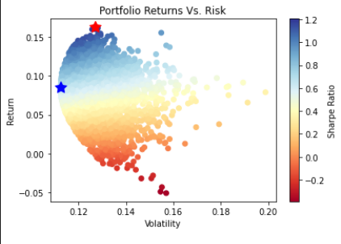
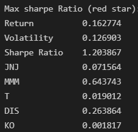
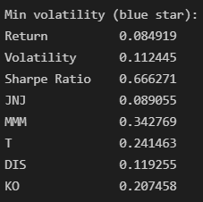

# Portfolio Optimization in Python

## Table of Contents

- [Overview](#overview)
- [Results](#results)
- [Setup](#setup)
- [Usage](#usage)
- [Main Technologies Used](#main-technologies-used)
- [Resources](#resources)

## Overview

A python data science project where we use stock price data from Yahoo Finance to optimize our portfolio according to the Modern Portfolio Theory.
Using a process called the Monte Carlo Simulation we can determine the probability of different outcomes based on the weights of each ticker.


## Results

<figure class="image">
  
  <figcaption><i>Portfolio metrics with the maximum sharpe ratio</i></figcaption>
</figure>
<figure class="image">
  
  <figcaption><i>Portfolio metrics with the maximum sharpe ratio</i></figcaption>
</figure>


## Setup

1. pip install dependancies: pathlib, numpy, pandas, matplotlib
2. Select preferred ticker symbols.
3. Change path of csv file to save price data to.
4. Adjust risk free rate or leave at default, 0.01 (or 1%).

Optionally you can also change the following: 
* 10000 simulations are ran. 
* Closing (not adj. close) is used. 


## Usage

Here is an example of usage.

```python
import pandas as pd
from pyopt.client import PriceHistory

# Define the symbols
symbols = ["JNJ", "MMM", "T", "DIS", "KO"]

...

# Change name of csv file
pathToPriceData = "..\data\some_new_name.csv"

...

# Adjust risk free rate
risk_free_rate = 0.01

...

# Optionally change the number of simulations to run
num_of_portfolios = 10000

...

# Optionally change the to adj close from close
price_df = price_df[['date', 'symbol', 'close']]

price_df = price_df.pivot(index='date', columns='symbol', values='close')
```

## Main Technologies Used
* Pandas
* Numpy
* Matplotlib
* Python 3


## Resources
[Portfolio Optimization with Python... by Shruti Dash](https://www.machinelearningplus.com/machine-learning/portfolio-optimization-python-example/#sharpe-ratio)

[Sigma Coding](https://www.youtube.com/watch?v=OYrDkK5q5Lw&list=PLcFcktZ0wnNnqefRpFMS1k9_VlhVw7bzc)

[Markowitz's Efficient Frontier in Python](https://medium.com/python-data/effient-frontier-in-python-34b0c3043314)